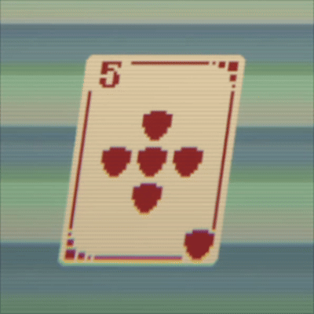

<p align="center">
  
</p>

<h1 align="center">💥 Sprite Fracturer 2D (Voronoi Edition)</h1>

<p align="center">
An organic, runtime 2D sprite fracturing system for Unity.<br/>
Procedurally shatters sprites into irregular Voronoi shards with physics, controllable random/fixed seeding, and automatic cleanup.
</p>

<p align="center">
  
  
  
</p>

---

## ⚡ What's Different in this Version?

This repository is a Voronoi refactor of the original grid-based `SpriteFracturer2D`. Standard uniform grid slicing cuts sprites into predictable squares—making broken cards, glass, or UI elements look like snapping chocolate bars. 

By replacing grid cuts with **Voronoi tessellation**, this tool generates organic, sharp, irregular fragments that feel far more dynamic and natural under impact.

---

## 📦 Installation

1. Copy the folder `Assets/SpriteFracturer2D/` into your Unity project.  
2. Ensure your sprite texture has **Read/Write Enabled** in its Unity Import Settings (the custom inspector will offer an automatic fix button if disabled).  
3. Add the **SpriteFracturer2D** component to any GameObject with a **SpriteRenderer**.  

---

## ⚙️ Component Overview

### 🔹 **Trigger Mode**
Defines how the fracture is initiated:
* **AutoStart** – Explodes automatically after a configurable delay.  
* **Collision** – Explodes on 2D physical impact (`OnCollisionEnter2D`).  
* **Trigger** – Explodes when entering a trigger volume (`OnTriggerEnter2D`).  
* **Manual** – Triggered programmatically via C# script.

### 🔹 **Voronoi & Shatter Settings**
* **Shard Count** → Total number of Voronoi sites/fragments generated across the sprite.  
* **Use Random Seed** → When `true`, generates a new random fracture pattern every time.  
* **Fixed Seed** → When `useRandomSeed` is `false`, uses a explicit integer seed (default `1337`) for reproducible, deterministic fractures (ideal for iconic card breaks or unique UI effects).

### 🔹 **Physics & Impulse**
* **Explosion Force** → Radial impulse applied to each individual shard.  
* **Upward Modifier** → Adds vertical bias to explosion trajectories.  
* **Piece Mass / Damping** → Adjusts gravity interaction, linear damping, and rotational torque for realistic movement.

### 🔹 **Destruction & Lifecycle**
* **Piece Lifetime** → How long shards persist before cleanup.  
* **Destroy on Collision** → Instantly arms shards to break upon impacting non-fracture environment colliders.  
* **Use Blink** → Flashes sprite transparency prior to piece destruction.  
* **Pieces as Trigger** → Sets shard colliders as triggers so they fall through geometry without physical blocking.

---

## 🧩 Usage

### **Simple Setup (No Code)**
1. Attach `SpriteFracturer2D` to a GameObject with a `SpriteRenderer`.  
2. Set your **Shard Count** and toggle **Use Random Seed**.  
3. Press **Play**.

### **Triggering via C#**
```csharp
using SpriteFracture;
using UnityEngine;

public class CardBreaker : MonoBehaviour
{
    [SerializeField] private SpriteFracturer2D fracturer;

    public void OnCardDestroyed()
    {
        // Triggers the Voronoi fracture programmatically
        StartCoroutine(fracturer.Fracture());
    }
}
```
---
## 📜 Credits & Acknowledgments

* **Original Author:** Based on the 2D grid fracture system by [Parein Jean-Philippe](https://github.com/pareinjeanphilippe) (or your source link).  
* **Voronoi Refactor:** Refactored to replace uniform grid slicing with Voronoi cell generation for organic 2D physics shattering.

---

## 📄 License

Distributed under the MIT License. See `LICENSE` for details.
